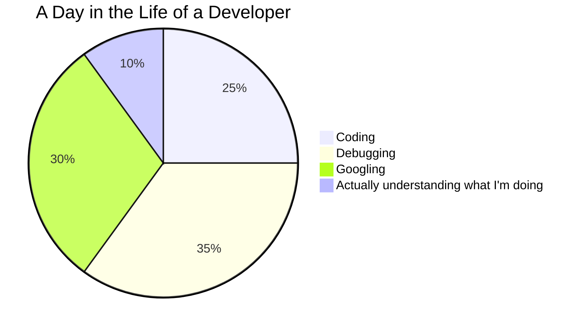

# 👋 Hello World, I'm [Your Name] 

<div align="center">
  
  
  ## 💻 _"I don't always code, but when I do, I prefer to do it in production"_ 💻
</div>

<p align="center">
  <a href="https://twitter.com/yourusername"></a>
  <a href="https://linkedin.com/in/yourusername"></a>
  <a href="https://dev.to/yourusername"></a>
</p>

## About Me

```javascript
const developer = {
  name: "Your Name",
  title: "Full Stack Developer | ML Enthusiast | Meme Connoisseur",
  location: "localhost:3000",
  workingOn: "Building the next big thing that nobody asked for",
  learning: "How to exit Vim (Day 937)",
  funFact: "My code works in my machine... and that's all that matters."
};
```

## Tech Stack
<p align="center">
  
  
  
  
  
</p>

## GitHub Stats

<div align="center">
  
  
</div>

## My Coding Journey
```
while (!success) {
    tryAgain();
    if (dead) break;
}
```

## Project Highlights
- 🚀 **[Project Alpha](https://github.com/yourusername/project-alpha)** - The one that almost works
- 💸 **[NFT Collection](https://github.com/yourusername/nft-collection)** - Because someone had to make the 1000th monkey JPEG
- 🤖 **[ML Model](https://github.com/yourusername/ml-model)** - It predicts stuff with 50% accuracy... flipping a coin has never been so complex

## Contribution Graph


<div align="center">
  
  ### My Contribution Streak
  
</div>

## Daily Routine



## Let's Talk!

<div align="center">
  
  
  ### "Feel free to reach out if you want to collaborate on projects that will either change the world or spectacularly fail trying!"
</div>

<!--
Easter egg: If you found this, you're spending too much time reading READMEs. Go touch grass. 🌱
-->
-->
