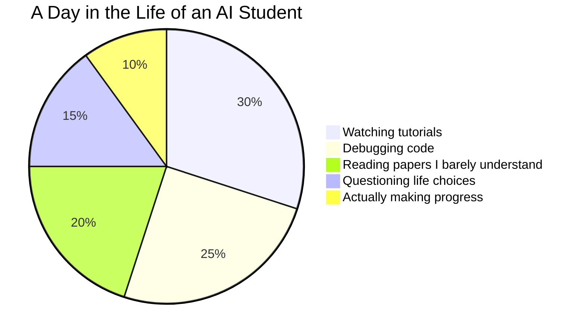

# Data Cleaning Pipeline Documentation

## Overview
This system is designed to process and clean content from a WordPress-based website, specifically handling both English and Arabic content. The pipeline extracts content from a MySQL database, processes it, and stores the cleaned data in Azure Blob Storage.

## Non-Technical Documentation

### Purpose
The system serves as a content processing pipeline that:
- Extracts content from a WordPress website
- Processes both English and Arabic content
- Cleans and formats the content for further use
- Stores the processed content in a cloud storage system

### Key Features
- Bilingual content processing (English and Arabic)
- Automated content cleaning and formatting
- Cloud-based storage solution
- Scheduled processing capabilities
- Error handling and logging


## Technical Documentation

### System Architecture

#### Components
1. **Database Connection Module** (`db_connection.py`)
   - Handles MySQL database connections
   - Executes queries for content extraction
   - Manages database credentials and connection parameters
   - Returns the extracted content and validate if it exists

2. **Data Cleaning Module** (`clean_data.py`)
   - Main processing logic
   - Handles content extraction and cleaning
   - Manages bilingual content relationships


3. **Text Processing Module** (`text_helpers.py`)
   - Cleans and formats text content
   - Handles HTML to Markdown conversion
   - Manages URL formatting
   - Sanitizes file names

4. **Storage Module** (`storage_helpers.py`)
   - Manages Azure Blob Storage operations
   - Handles file storage and retrieval
   - Provides local file storage capabilities
   - Implements secure blob upload with overwrite protection
   - Manages storage connection and container access

5. **Environment Configuration** (`env.py`)
   - Manages environment variables
   - Handles configuration parameters
   - Stores sensitive credentials

### Data Flow
1. Content is extracted from WordPress database
2. Content is processed and cleaned
3. Bilingual relationships are established
4. Processed content is stored in Azure Blob Storage

### Technical Requirements
- Python 3.x
- MySQL Database
- Azure Blob Storage Account
- Required Python Packages:
  - mysql-connector-python
  - azure-storage-blob
  - beautifulsoup4
  - regex

### Configuration
The system requires the following environment variables:
- Database Configuration:
  - `user`: Database username
  - `password`: Database password
  - `host`: Database host
  - `port`: Database port
  - `database`: Database name
  - `ssl_disabled`: SSL configuration

- Storage Configuration:
  - `storage_connection_string`: Azure Blob Storage connection string
  - `output_container_name`: Azure Blob Storage container name

### Error Handling
The system implements comprehensive error handling:
- Database connection errors
- Content processing errors
- Storage operation errors
- Logging of all errors and warnings

### Logging
The system maintains detailed logs for:
- Database operations
- Content processing
- Storage operations
- Error tracking
- System status

### Database Queries and Content Extraction

#### Core Queries
The system uses two main queries to extract content from the WordPress database:

1. **Zones Content Query**
```sql
SELECT `ID`,`post_content`,`post_title`,`post_status`,`guid`,`post_type`
FROM `wp_posts`
WHERE `post_status` = "publish" AND (`post_type` = "page" OR `post_type` = "post");
```
- Extracts content from the main WordPress table (`wp_posts`)
- Retrieves only published pages and posts
- Captures essential fields: ID, content, title, status, GUID, and post type
- Used for processing content from the main site

2. **Authority Content Query**
```sql
SELECT `ID`,`post_content`,`post_title`,`post_status`,`guid`,`post_type`
FROM `wp_4_posts`
WHERE `post_status` = "publish" AND (`post_type` = "page" OR `post_type` = "post");
```
- Extracts content from the secondary WordPress table (`wp_4_posts`)
- Follows the same filtering criteria as the zones query
- Used for processing content from the authority section of the site

#### Query Importance
These queries are critical to the system because:
- They form the foundation of content extraction
- Ensure only published and relevant content is processed
- Maintain data integrity by selecting specific fields
- Support the bilingual content processing pipeline
- Enable proper content mapping between English and Arabic versions

#### Taxonomy Queries
The system also uses taxonomy queries to establish relationships between English and Arabic content:
```sql
SELECT `description` FROM `wp_term_taxonomy` WHERE `taxonomy`= 'post_translations';
SELECT `description` FROM `wp_4_term_taxonomy` WHERE `taxonomy`= 'post_translations';
```
- These queries help map translations between languages
- Essential for maintaining content relationships
- Support the bilingual content processing

### Storage Architecture

#### Storage Endpoint
The processed content is stored in Azure Blob Storage with the following structure:

```
https://<storage-account>.blob.core.windows.net/<container-name>/<file-name>
```

Where:
- `<storage-account>`: Your Azure Storage account name
- `<container-name>`: The configured output container (from environment variables)
- `<file-name>`: The processed file name following the convention: `<arabic_id>_<arabic_title>_<english_id>_<english_title>_<site_label>.txt`

#### Content Access
The stored content can be accessed through:
1. Azure Portal interface
2. Azure Storage Explorer
3. REST API endpoints
4. Azure SDK for various programming languages

## Usage

### Running the Pipeline
The pipeline can be run in two ways:
1. **Manual Execution**: Run the `clean_data.py` script directly
2. **Scheduled Execution**: Use the Azure Functions timer trigger

### Output Format
Processed files are stored with the following naming convention:
```
<arabic_id>_<arabic_title>_<english_id>_<english_title>_<site_label>.txt
```

### Content Processing
The system performs the following cleaning operations:
- HTML to Markdown conversion
- URL formatting
- Text sanitization
- Bilingual content matching
- File name sanitization

## Maintenance and Support

### Monitoring
- System logs should be regularly monitored
- Azure Blob Storage usage should be tracked
- Database connection health should be verified

### Troubleshooting
Common issues and solutions:
1. Database Connection Issues
   - Verify credentials
   - Check network connectivity
   - Validate database permissions

2. Storage Issues
   - Verify Azure credentials
   - Check container permissions
   - Validate connection string

3. Content Processing Issues
   - Check input data format
   - Verify text encoding
   - Validate HTML structure

## Security Considerations
- Database credentials are stored as environment variables
- Azure storage credentials are secured
- SSL connections are configurable
- Access controls are implemented at both database and storage levels


# 👋 Hello World, I'm Anerud Thiyagarajan 
<div align="center">
  
  
  ## 🤖 _"I don't always train models, but when I do, I prefer to run out of VRAM"_ 🧠
</div>

<p align="center">
  <a href="[https://linkedin.com/in/yourusername](https://www.linkedin.com/in/anerud-thiyagarajan)"></a>
  <a href="[https://huggingface.co/yourusername](https://huggingface.co/Anerud)"></a>
</p>

## About Me

```python
ai_student = {
    "name": "Anerud Thiyagarajan",
    "title": "AI and ML Student | Amrita Vishwa Vidyapeetham",
    "location": "localhost:8888/jupyter",
    "currently": "Trying to explain backpropagation to my cat",
    "learning": "PyTorch, Transformers, and how to survive on ramen",
    "funFact": "I have more saved Jupyter notebooks than saved money"
}
```

## Tech Stack
<p align="center">
  
  
  
  
  
</p>

## GitHub Stats

<div align="center">
  
  
</div>

## My AI Journey
```python
while not model.is_sentient():
    model.train(epochs=1000)
    if resources.gpu_melted:
        break
```

## Project Highlights
- 🗣️ Indian Language Speech Recognition - Fine-tuning state-of-the-art models for Indian languages
  [Whisper-small](https://github.com/yeager209904/Whisper-small)
  [Wav2Vec2-XLS-R-53](https://github.com/yeager209904/Wav2Vec2-XLS-R-53)
  [HuBert-large](https://github.com/yeager209904/HuBert-large)
- 🧠 **[Face Recognition using SVD](https://github.com/yeager209904/Face_Recognition_using_SVD)** - Leveraging Singular Value Decomposition for facial recognition

## Contribution Graph


<div align="center">
  
  ### My Training Progress
  
</div>



Let's Connect!
<div align="center">
  
  <p>"Open to collaborate on projects, study groups, or just commiserating about neural networks!"</p>
</div>
<!--
Easter egg: This profile README was made while procrastinating on an actual assignment. The irony is not lost on me.
-->
